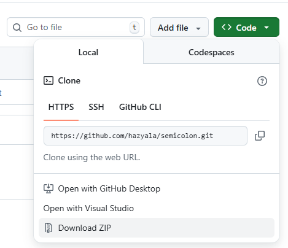
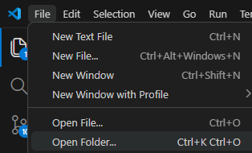

"# Semicolon 동아리 프로젝트

이 저장소는 **세미콜론 동아리**에서 마크다운(Markdown)을 학습하고 문서화하는 연습을 위해 만든 예제 프로젝트입니다. 팀원들은 이를 통해 마크다운 파일을 읽고, 편집하며, 자유롭게 사용할 수 있으면 좋겠습니다.

---

## 📄 이 리포지토리에 포함된 문서

다음 파일들은 팀원들이 마크다운 문법을 빠르게 이해하고 활용할 수 있도록 구성되어 있습니다.

| 파일 경로 | 내용 요약 |
| --- | --- |
| `README.md` | 이 문서. 프로젝트 소개 및 각 문서 설명을 담고 있습니다. |
| `markdown/what_is_markdown.md` | 마크다운의 기본 문법 예시(제목, 강조, 목록, 코드 블록, 인용, 표, 링크, 이미지 등)를 보여주는 샘플 파일입니다. |
| `markdown/how_to_use.md` | 마크다운 파일을 작성하고 관리하는 방법 또는 사용 예시를 담은 문서입니다. |
| `git/mandatory_commands.md` | git에서 가장 많이 쓰이는 필수 명령어 모음입니다. |
| `git/what_is_git.md` | git이 무엇인지, github가 무엇인지 등 간략하게 기재하둔 문서입니다.|

---

## 📌 사용 방법

1. 이 저장소를 다운받습니다.

2. VS Code 등에서 파일을 열어 내용을 확인합니다.

3. 프로젝트 내용이나 방법에 대해 모르겠거나 질문이 생기면 AI에게 물어보거나 저한테 오시면 친.절.히.천.천.히 알려드릴테니까 부디 물어보시고 충분히 이해하시기 바랍니다.
---
