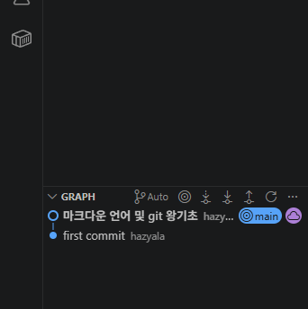

# Git 관리 전략
> ### 1. git flow 
> ### 2. github flow
>> git flow는 전문적인 개발을 할 때 주로 사용하고, github flow는 git flow에 비해 간소화되어 가볍게 진행하기 위해 만들어진 기법입니다. 

## git branch
1. 여러 개발자가 하나의 타임라인에서 개발하면 서로 충돌이 일어나기 쉽고, 버전 관리라는 명목에서 벗어남. 따라서 기능에 따라, 사용자에 따라 타임라인을 분리하여 사용할 수 있도록 branch 라는 독립된 타입라인으로 작업 할 수 있게 도와주는 기능
(쉽게 타임라인 으로 생각하면됨. 하나의 타임라인이었다가 일부 갈라졌다가 멀티버스(다중 브렌치)로 나누어지기도 하고 병합되기도 하는 그러한 것임...)

2. branch의 동그라미 : 타임라인의 동그라미는, 커밋 기록을 나타냄. 이 동그라미들로 각 커밋의 내역을 확인하고 추적할 수 있음. 보통 git은 백업용으로 많이 쓰지만, 프로젝트의 경우 백업용으로 사용하면 추후 추적에 문제가 될 수 있으니 추적하기 쉬운 목적별로 커밋을 하는 것이 좋음. 이 동그라미들이 꼬일것을 방지하여 flow관리 전략들이 사용됨.
> 

3. 자잘한 동그라미들, 브렌치들을 합치는 Squash, Rebase 등이 있음. merge 하여 다른 브렌치에 병합될때도 하나의 동그라미로 기록됨.

## git flow (상위 브렌치에서 하위 브렌치 순서)
> 이 브렌치 명들은 그냥 개발 국룰 같은것임.... 꼭 이렇게 해야만 한다는 아니지만 대중적으로 이렇게 사용함....
- main : 최상위 브렌치로 무결점의 모든 기능이 들어있는 브렌치
- develop : 총괄 브렌치로 하위 브렌치에서 만들어진 각 기능들이 develop 브렌치로 모여서 배포시 소멸되는 브렌치
- release : 필요할 때 시용되는 브렌치로 develop 브렌치에 가기 전에 검수를 하기 위해 존재하며 작업 완료 후 병합되어 소멸되는 브렌치
- hotfix : 상위 브렌치에 오류가 있거나 특별히 수정할 사항이 생겼을때 main에서 파생하여 급히 수정할때 사용하고 병합되어 소멸되는 브렌치
- feature : 개인 작업용 브렌치라고 할 수 있음. 예를 들어, 개발 단위를 백엔드, 프론트엔드 등으로 나누지 않고 각 함수별로 나눈다고 가정합니다. 이때 함수의 주 기능 (ex. 자판기 만들건데 장바구니 계산하는 로직에서 물건 더해지는 부분은 A가 물건 빠지는 부분은 B가 하기로 분업했지만, 장바구니 기능은 1개의 주기능임)이 같을 경우 하나의 장바구니 develop으로 들어가겠죠? 그럴 때 feature/이슈번호/장바구니 더하기 이런식으로 개발되고 develop에 병합(merge) 되어 없어지는 브렌치.

## github flow (gitflow쓸 작업은 아니니까 우리는 일단 이거 사용할거임)
> gitflow를 사용할 필요가 없는 소규모 프로젝트에서 사용하는 브렌치
- main 브렌치 : 배포용으로 주로 사용하는 브렌치
- 이슈, PR에 맞춰 일시적으로 작업하기 위해 사용하는 브렌치 (이슈번호/기능 등으로 브렌치 명을 붙임)
```
[관리 방법]
1. 커밋과 푸시: 로컬 저장소에서 작업을 수행하고 커밋한 뒤, 원격 저장소(GitHub)의 동일한 브랜치에 주기적으로 Push하여 작업 내역을 공유
2. Pull Request (PR) 오픈: 작업이 완료되거나 피드백이 필요할 때 PR을 생성. 즉, 팀장이 이슈 할당을 안해준 경우나 어떤 코드에 대해 의견이 있을때도 수정하고자 하는 코드를 온전하게 작성하여 PR요청하면 merge가능.
```

## 과제 방법 
- 레포짓토리를 clone하여 다운 받은 뒤, 할당된 이슈에 맞는 `feature/이슈번호/영어 기능명` 으로 브렌치를 생성하여 코드를 작성하고 push해서 PR을 요청하세요. merge제가 하니까 pull만 잘하시면 크게 꼬일 일은 없을 겁니다. 맘 약해져서 처음 하시니까 난이도 좀 낮춰드림
- PR이 요청된 후 제가 확인 후 merge해드리겠습니다. 계속 pull해서 최신화된 내역을 확인하며 과제를 수행해주시면 됩니다.
- vs를 쓰시던 vscode에서 익스텐션 깔아서 하시던 상관 없습니다. 
> 원래 1부터 0까지 여러분들끼리 해보게 할랬는데 일단 이번에 merge는 제가 해드림. 다음에는 merge도 이슈 할당도 여러분들끼리 하도록 과제 내드릴 것임..... 그리고 원래는 이렇게 짬뽕해서 여러가지 과제가 있는 레포짓토리를 사용하지는 않습니다. 보통은 따로 레포짓토리를 파서 쓴 뒤 레포짓토리를 병합하지만, 간단한 과업이므로 그냥 하십시다.
>
