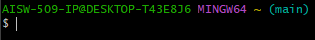
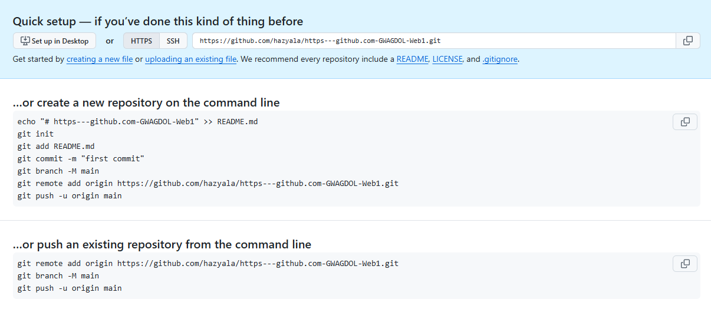

# Git 필수 명령어 가이드

이 문서는 Git을 처음 접하는 팀원들을 위해 작성되었습니다.
명령어는 프로젝트를 시작하고 저장소를 관리하는 시간 순서
(레포지토리 생성 → 연결 → 커밋 → 푸시 → 관리)대로 나열되어 있습니다.

## 1. 레포지토리 생성 (초기화)
프로젝트 폴더를 Git으로 관리하기 시작할 때 가장 먼저 사용하는 명령어입니다.

```
git init
```
> 설명: 현재 작업 중인 폴더를 Git 레포지토리(저장소)로 만듭니다. 이 명령어를 실행하면 변경 사항을 추적하는 숨김 폴더인 `.git`이 생성됩니다. git repository 라고 하는 것은 로컬 파일 1개 당 클라우드 1개로 연결한다고 생각하시면 편합니다. 최상위 파일 1개당 레포짓토리 1개입니다. 따라서 레포짓토리 관리의 용이성을 위해 처음부터 폴더 구조를 생각해두시는게 좋습니다. 레포짓토리를 관리하는 subtree 와 같은 기능이 있지만 고급 기능으로 추후에 알아보도록 합니다.

## 2. 첫 레포지토리 연결 (원격 저장소 연결)
내 컴퓨터(로컬)의 저장소를 GitHub(원격)에 만들어둔 저장소와 연결하는 과정입니다.

```
git remote add origin [GitHub_레포지토리_주소]
```
> 설명: 원격 저장소를 `origin`이라는 기본 이름으로 추가합니다. 괄호 부분에는 GitHub에서 복사한 주소(URL)를 입력합니다.

## 3. 커밋 (변경 사항 저장)
작업한 파일의 변경된 내용을 하나의 버전으로 묶어서 기록(저장)하는 과정입니다.

```
git add .
```
> 설명: 변경된 모든 파일을 커밋할 준비 상태(Staging Area)로 올립니다. 점(`.`)은 현재 폴더의 모든 변경 사항을 의미하며, 특정 파일만 올리려면 점 대신 파일 이름을 정확히 입력합니다.

```
git commit -m "첫 번째 커밋 메시지"
```
> 설명: 준비 상태에 올라간 파일들을 하나의 확정된 버전으로 저장합니다. `-m` 옵션 뒤의 큰따옴표 안에는 어떤 변경 사항이 있었는지 이 업로드가 어떤 업로드 인지 등 요약하는 메시지를 간결하게 작성합니다.

## 4. 푸시 (원격 저장소로 업로드)
내 컴퓨터(로컬)에 커밋된(저장된) 내역을 GitHub 원격 저장소로 보내어 백업 및 공유하는 과정입니다.

```
git push -u origin main
```
> 설명: 로컬의 `main` 브랜치 내용을 `origin`이라는 이름의 원격 저장소로 업로드합니다. `-u` 옵션을 한 번 사용해 두면, 다음 작업부터는 단순히 `git push`만 입력해도 자동으로 동일한 경로로 업로드됩니다. 뭔가 오류가 뜬다면 `git push -u origin master`로 브렌치 명을 바꿔보세요.
 git bash 라고 하는 터미널 화면입니다. 처음에 보이는 것이 경로이고 괄호 안에 있는것이 브렌치입니다. 브렌치가 어디인지 항상 확인하시는게 좋습니다. 브렌치 확인 명령어 등도 있으나 나중에 알아보도록 합시다.

## 5. 관리용 명령어 (이름 변경 및 삭제)
추후 저장소 관리가 필요할 때 사용하는 명령어입니다.

### 브랜치 이름 변경
```
git branch -m [새로운_브랜치_이름]
```
> 설명: 현재 작업 중인 브랜치의 이름을 지정한 새로운 이름으로 변경합니다. 
git을 처음 설치할 때 원하는 브랜치 명을 지정할 수 있습니다. 기본으로 설치했다면 기본 브렌치명은 `master` 이지만 관례상 `main` 을 주로 사용합니다. 기업이나 단체에서는 특정 브렌치명을 사용하기도 합니다. 따라서 저희는  `git branch -m main`을 주로 사용 하시면 됩니다. 매번 깃 브렌치 명을 변경하기 귀찮다면 삭제 후 재설치하며 브렌치명을 지정해보세요.브렌치에 대해서는 추후에 또 알아보도록 하겠습니다.

### 레포지토리 삭제 (Git 관리 취소)
```
rm -rf .git
```
> 설명: 현재 폴더의 `.git` 폴더를 강제로 삭제하여 Git 관리를 완전히 취소합니다. Mac 및 Linux 환경에서 사용하며, 실행 시 복구할 수 없으므로 매우 주의해야 합니다. (Windows 환경의 명령 프롬프트에서는 `rmdir /s /q .git` 을 사용합니다.) github에서도 git repository를 삭제할 수 있습니다. 삭제하고자하는 repository의 setting에 들어가서 최하단에 있는 Delete this repository 를 통해 삭제 가능합니다.

# 💡 요약

> 평소에 레포짓토리를 처음 연결 할때는 github에서 깃 레포짓토리 생성 후 그냥 이거 복사 붙여넣기 해서 쓰면 아주 편합니다. 하지만 이 명령어들은 기본적으로 익혀두시는게 정신건강에 이로우니 익히시길 바랍니다. 