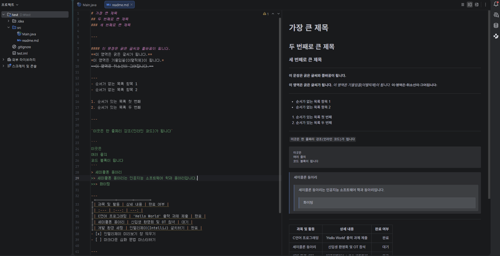
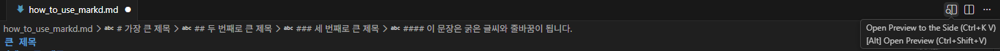

# 가장 큰 제목
## 두 번째로 큰 제목
### 세 번째로 큰 제목

--- 

**이 영역은 굵은 글씨가 됩니다.**
*이 영역은 기울임꼴(이탤릭체)이 됩니다.*
~~이 영역은 취소선이 그어집니다.~~

---
- 순서가 없는 목록 항목 1
- 순서가 없는 목록 항목 2

1. 순서가 있는 목록 첫 번째
2. 순서가 있는 목록 두 번째

---

`이곳은 한 줄짜리 강조(인라인 코드)가 됩니다`

```
이곳은
여러 줄의
코드 블록이 됩니다
```

> 세미콜론 동아리
>> 세미콜론 동아리는 인공지능 소프트웨어 학과 동아리입니다.
>>> 화이팅

---
| 과목 및 활동 | 상세 내용 | 완료 여부 |
| :--- | :---: | ---: |
| C언어 프로그래밍 | 'Hello World' 출력 과제 제출 | 완료 |
| 세미콜론 동아리 | 신입생 환영회 및 OT 참석 | 대기 |
| 개발 환경 세팅 | 인텔리제이(IntelliJ) 설치하기 | 완료 |
- [x] 인텔리제이 미리보기 창 띄우기
- [ ] 마크다운 심화 문법 마스터하기

---

[구글로 이동하기](https://www.google.com)


---

>## 다음은, IDE (통합 개발 환경) 에서 md 파일을 작성하는 예시입니다.
>>
위 이미지는 **인텔리제이**에서 사용하는 예시입니다.
>>
위 이미지는 `비주얼 스튜디오 코드` 에서 사용하는 예시입니다.
    * 이처럼 마크다운 언어를 통해 문서를 작성 할 수 있습니다.
